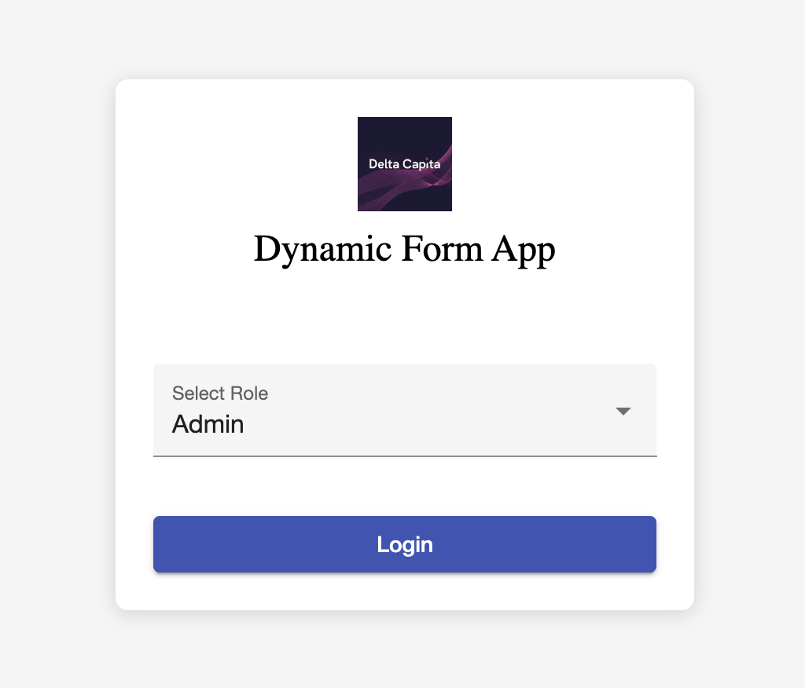
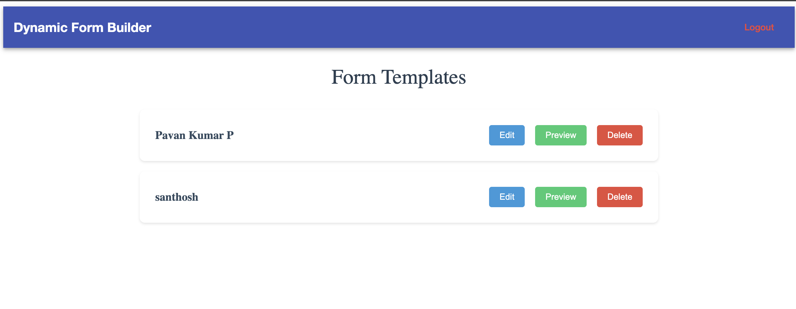
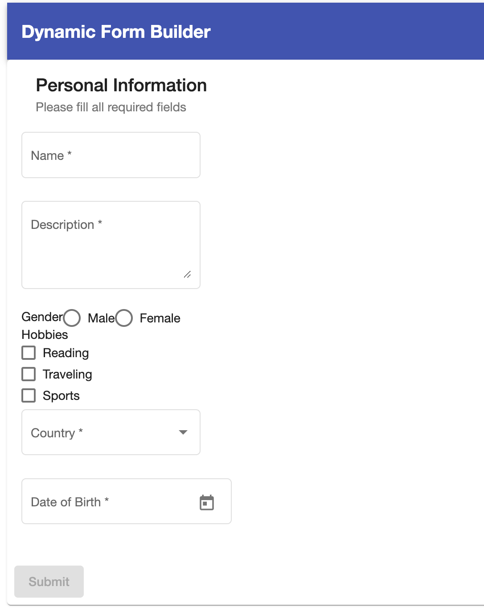

# 📄 Dynamic Form Builder – Angular (Admin & User Roles)

This project is a **dynamic form builder and renderer** built using Angular. It allows **admins to mange form templates** and **users to fill and submit them**. The system supports role-based access, form preview, dynamic controls, and local persistence.
---

## 🚀 Features

- ✅ **Role Based Login**
- ✅ **Dynamic Form Rendering** (User side)
- ✅ **Reactive Forms with Validation**
- ✅ **Checkbox, Radio, Select, Date, Text, Textarea Support**
- ✅ **Local Storage Persistence**
- ✅ **Angular Material UI**
- ✅ **Role-Based Routing (Admin/User)**
- ✅ **Form Reset, Save & Validation Feedback**
- ✅ **Logout Feature**
- ✅ **NgRx State Management**

---

## 🛠 Tech Stack

- **Angular** 14+
- **Angular Material** for UI components
- **Reactive Forms**
- **LocalStorage** for mock API
- **Typescript**
- **NgRx** for state management

---

## 📂 Project Structure (Brief)

```
src/
├── app/
│   ├── form-fill/             # Form rendering and submission
│   ├── form-list/             # List of form templates
│   ├── services/              # FormTemplateService for CRUD
│   ├── state/                 # NgRx Actions, Reducers, Selectors
│   └── app-routing.module.ts # Routes with role-based access
```

---

## ▶️ Run Locally

```bash
# Clone the repo
git clone https://github.com/pavan2540/Dynamic-fb-Angular-Admin-User.git
cd Dynamic-fb-Angular-Admin-User

# Install dependencies
npm install

# Start the app
ng serve
```

---

## 🧰 Screenshots





## 🧰 Available Scripts

- `ng serve` – Run the dev server
- `ng test` – Run unit tests
- `ng build` – Build the app for production

---
